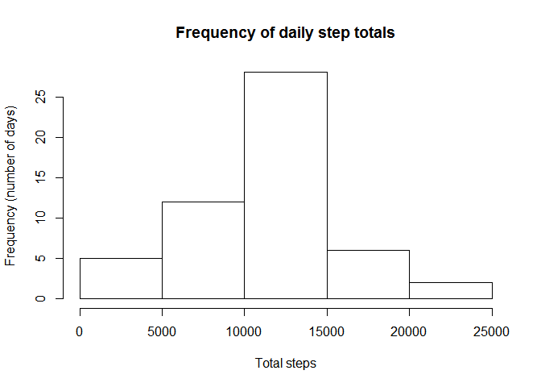
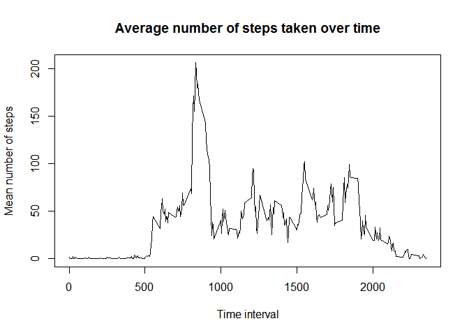
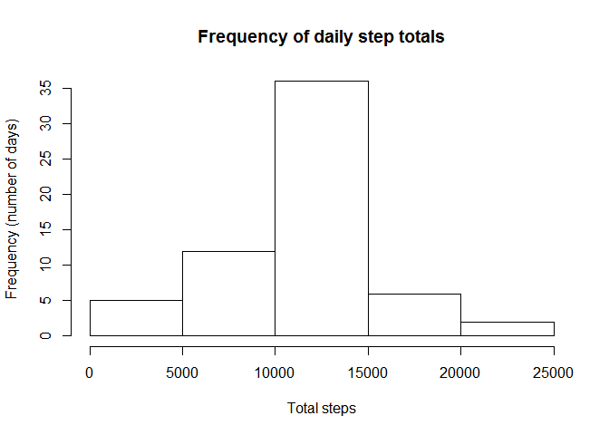
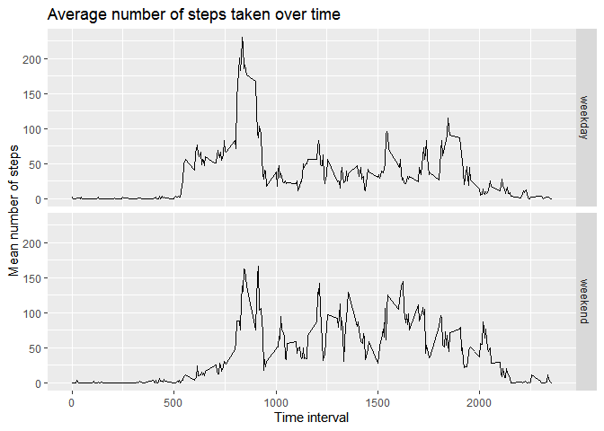

## Loading and preprocessing the data

```r
stepsdat <- read.csv("activity.csv")
stepsdat$date <- as.Date.factor(stepsdat$date)
```


## What is mean total number of steps taken per day?

To calculate the mean total number of steps per day, we first calculate the total number of steps taken per day.

```r
totalsteps <- aggregate(stepsdat$steps, by=list(stepsdat$date), FUN=sum)
names(totalsteps) <- c("date", "total_steps")
```

To visualise this data, we create the histogram below which shows the frequency of days with
each total number of steps.

```r
with(totalsteps, hist(total_steps,main="Frequency of daily step totals", 
     xlab="Total steps", ylab = "Frequency (number of days)"))
```

<!-- -->

The code below then calculates the mean and median number of steps across all days.

```r
meansteps <- mean(totalsteps$total_steps, na.rm=TRUE)
mediansteps <- median(totalsteps$total_steps, na.rm=TRUE)
```
The mean is 1.0766189\times 10^{4} and the median is 10765.

## What is the average daily activity pattern?

The code below finds the number of steps for each time interval, averaged across all days. 
It then creates a time series plot to visualise this data.

```r
timeseries <- aggregate(stepsdat$steps, by=list(stepsdat$interval), FUN=mean, na.rm=TRUE)
names(timeseries) <- c("interval", "mean_steps")
with(timeseries, plot(x=interval, y=mean_steps, type="l", 
                      main="Average number of steps taken over time",
                      xlab= "Time interval", ylab= "Mean number of steps"))
```

<!-- -->

We then find the 5-minute interval that, on average, contains the maximum number of steps.

```r
maxsteps <- timeseries[which.max(timeseries$mean_steps),2]
```

This is 206.1698113 and matches the results shown in our time series plot.


## Imputing missing values

To calculate the number of missing values we use the following code:

```r
library(dplyr)
```

```
## 
## Attaching package: 'dplyr'
```

```
## The following objects are masked from 'package:stats':
## 
##     filter, lag
```

```
## The following objects are masked from 'package:base':
## 
##     intersect, setdiff, setequal, union
```

```r
missingindicator <- mutate(stepsdat, missing = as.numeric(is.na(steps)))
missingtotal <- sum(missingindicator$missing)
```
The total number of rows with NAs is 2304.

Our strategy for filling in the missing values is to use the mean across all days
for each 5-minute interval. The below code fills in the missing values and creates
a new dataset that is equal to the original, but with the missing data filled in, called "imputed".

```r
imputed <- missingindicator
for (i in (1:nrow(imputed))){
        if(is.na(imputed[i,1])){
                imputed[i,1] <- timeseries[which(timeseries$interval == imputed[i,3]),2]
        }
}
imputed <- select(imputed, steps, date, interval)
```

The data within this new dataset can be visualised as a histogram.

```r
totalstepsimputed <- aggregate(imputed$steps, by=list(imputed$date), FUN=sum)
names(totalstepsimputed) <- c("date", "total_steps")

with(totalstepsimputed, hist(total_steps, main="Frequency of daily step totals", 
                             xlab ="Total steps", ylab = "Frequency (number of days)"))
```

<!-- -->
  
We, again, calculate the mean and median steps taken per day, as follows.

```r
meanstepsimputed <- mean(totalstepsimputed$total_steps, na.rm=TRUE)
medianstepsimputed <- median(totalstepsimputed$total_steps, na.rm=TRUE) 
```
The mean is 1.0766189\times 10^{4} and the median is 1.0766189\times 10^{4}.
The mean doesn't differ from our original result, since we've just imputed the mean value into the dataset (this works because the missing values belonging only to 8 complete days.)
The median has increased slightly (to the mean value) due to an increase (by 8) in the number of days with 1.0766189\times 10^{4} steps.

## Are there differences in activity patterns between weekdays and weekends?
To calculate where there are differences in patterns between weekdays and weekends,
we first create a factor variable to categorise the data.

```r
library(dplyr)
stepsdatday <- mutate(imputed, daytype = "")

for (i in (1:nrow(stepsdatday))){
if(weekdays(stepsdatday[i,2]) == "Saturday" |weekdays(stepsdatday[i,2]) == "Sunday"){
       stepsdatday[i,4] <- "weekend"
}else{
        stepsdatday[i,4] <- "weekday"
}
}
stepsdatday <- mutate(stepsdatday, daytype = as.factor(daytype))
```
We can then summarise this data and plot it as a time series to examine the differences
in activity patterns.

```r
stepsavgday <- aggregate(stepsdatday$steps, by=list(stepsdatday$daytype,stepsdatday$interval), FUN=mean)
names(stepsavgday) <- c("daytype", "interval", "mean_steps")
library(ggplot2)
qplot(x=interval, y=mean_steps, data=stepsavgday,facets=daytype~., geom="line",
      main="Average number of steps taken over time",
      xlab= "Time interval", ylab= "Mean number of steps")
```

<!-- -->
